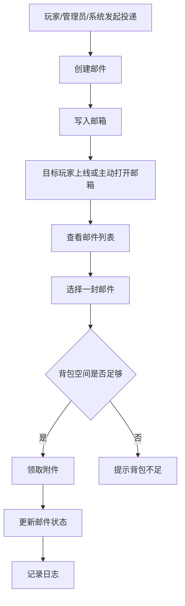
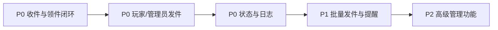

# RookiePostBox 产品需求文档

## 1. 文档目标

本 PRD 用于明确 `RookiePostBox` 的首发产品范围，避免插件继续以“技术原型”的方式增长。

文档关注的是：

- 谁在用
- 解决什么问题
- 首发必须做什么
- 哪些功能可以后置
- 什么标准算做完

---

## 2. 产品定义

`RookiePostBox` 是一个 Minecraft 服务器内的“邮件与物品投递插件”。

它的核心价值不是“存东西”，而是：

- 让玩家和系统可以稳定地向某个玩家投递物品
- 让玩家可以在方便、可追踪、可恢复的流程中领取附件
- 让服主和管理员可以做补偿、奖励、活动发放与问题排查

一句话定义：

> 一个面向玩家投递、系统奖励发放、管理员补偿处理的站内邮件箱插件。

---

## 3. 用户角色

### 3.1 普通玩家

诉求：

- 给其他玩家发物品
- 收取别人或系统发来的邮件
- 清楚知道邮件内容和来源
- 在不丢失物品的情况下完成领取

### 3.2 服主 / 管理员

诉求：

- 给单个玩家发补偿
- 给一批玩家发奖励
- 查询某个玩家是否收到、是否领取
- 删除异常邮件
- 在纠纷发生时能追踪记录

### 3.3 其他插件 / 系统模块

诉求：

- 通过 API 发放活动奖励、任务奖励、商城商品
- 不依赖目标玩家在线
- 尽量避免重复发放或丢件

---

## 4. 核心问题

当前大多数服务器场景里，物品投递存在几个常见痛点：

- 玩家不在线时无法直接交易
- 管理员补偿常依赖手动发放，效率低且容易出错
- 活动奖励和商城发货缺少稳定的离线收件方式
- 出现纠纷时，缺少可查的发件与领取记录

`RookiePostBox` 需要解决的就是这四类问题。

---

## 5. 首发版本目标

首发版本不是“功能最多”，而是“最小可上线”。

首发目标：

1. 玩家可以可靠收件和领件
2. 管理员可以可靠发件和查件
3. 系统可以离线投递奖励
4. 数据层具备基本可靠性和可追踪性

不追求首发完成：

- 跨服能力
- Web 后台
- 高级营销系统
- 复杂模板系统

---

## 6. 核心业务流程

---

## 7. 核心场景

### 场景 1：玩家给玩家发件

示例：

- A 玩家想把一把武器送给 B 玩家，并附带留言

要求：

- B 不在线时也能收到
- A 能确认发件是否成功
- B 能在邮箱中看到来源和内容

### 场景 2：管理员补偿

示例：

- 管理员给某个误封补偿玩家发放一组道具

要求：

- 不要求目标在线
- 记录发件人、时间、邮件内容
- 管理员可查是否被领取

### 场景 3：系统奖励投递

示例：

- 活动、任务、商城、签到系统向玩家发奖励

要求：

- 有稳定 API
- 支持高频调用
- 避免重复发奖

### 场景 4：玩家领取失败恢复

示例：

- 玩家点击领取时背包满

要求：

- 不吞件
- 不错误标记为已领取
- 玩家清包后可再次领取

### 场景 5：管理员排查纠纷

示例：

- 玩家声称“我没收到补偿”

要求：

- 能查询该玩家邮箱记录
- 能看到是否发出、是否领取、何时领取

---

## 8. 必须功能

下面这些是首发版本必须具备的功能。

### 8.1 玩家收件箱

说明：

- 玩家可以打开自己的邮箱 GUI
- 可分页浏览邮件
- 每封邮件至少展示：
  - 发送者
  - 留言
  - 时间
  - 附件概要
  - 状态

为什么必须：

- 这是插件最核心的玩家入口

### 8.2 玩家发件

说明：

- 至少支持命令式发件
- 建议首发命令：
  - `/rookiepostbox send <player> <message>`

要求：

- 从主手读取物品或从发件 GUI 中选定物品
- 发件成功前不能吞物品
- 发件失败时必须有明确提示

为什么必须：

- 没有玩家间发件，就不是完整邮件系统

### 8.3 离线投递

说明：

- 目标玩家不在线时，邮件仍然可以进入邮箱

为什么必须：

- 这是邮件系统与普通交易系统的本质区别

### 8.4 安全领取

说明：

- 玩家领取时必须检查背包空间
- 领取失败时邮件状态不能错误变更
- 不能重复领取同一封邮件

为什么必须：

- 这是最关键的数据安全能力

### 8.5 邮件状态管理

首发至少支持：

- `未领取`
- `领取中`
- `已领取`
- `已过期`

为什么必须：

- 单靠“领完删除”无法支持审计、恢复和运营管理

### 8.6 管理员发件

说明：

- 管理员可以给指定玩家投递邮件
- 适用于补偿、活动、手动奖励

为什么必须：

- 这是服主最真实的使用场景之一

### 8.7 管理员查件

说明：

- 能查看某个玩家邮箱内容
- 能查看邮件状态
- 能删除异常邮件

为什么必须：

- 没有查件与删件能力，插件无法运营

### 8.8 系统/API 发件

说明：

- 提供稳定 API 供其他插件调用

最少支持：

- 发邮件
- 查收件箱概要
- 查询邮件状态

为什么必须：

- 商城、任务、签到、活动等奖励系统都需要这个能力

### 8.9 配置文件

首发必须可配置：

- 数据库连接
- GUI 分页大小
- 过期时间
- 文案
- 权限开关
- 调试日志开关

为什么必须：

- 没有配置能力就不具备发布条件

### 8.10 日志与审计

至少记录：

- 谁发给谁
- 发送时间
- 附件概要
- 是否领取
- 领取时间
- 管理员删除操作

为什么必须：

- 没有日志就无法处理纠纷

---

## 9. 非必须但建议尽快补上

### 9.1 批量发件

示例：

- 全服补偿
- 给某权限组发奖励

### 9.2 新邮件提醒

示例：

- 玩家上线提醒
- 打开菜单前提示未领取数量

### 9.3 附件完整预览

示例：

- 一封邮件含多个附件时，玩家能完整查看而不是只看第一件

### 9.4 过期自动清理

示例：

- 定时清理过期邮件

### 9.5 批量领取

示例：

- 一键领取全部可领取邮件

---

## 10. 后续版本功能

这些功能有价值，但不应进入首发版本范围。

- 邮件模板系统
- 邮件退回
- 跨服邮箱同步
- Web 管理后台
- 玩家黑名单 / 拒收设置
- 邮件分类标签
- 更细粒度的统计报表

---

## 11. 功能优先级

### P0

- 玩家收件箱
- 玩家发件
- 离线投递
- 安全领取
- 邮件状态
- 管理员发件
- 管理员查件
- API 发件
- 配置文件
- 日志与审计

### P1

- 批量发件
- 新邮件提醒
- 附件完整预览
- 过期自动清理

### P2

- 批量领取
- 邮件模板
- 跨服能力
- Web 后台

---

## 12. 成功指标

首发上线后，至少希望达到：

- 玩家能够独立完成收件和领件
- 管理员可以完成补偿发放而不必手动在线交易
- 离线玩家可以稳定收到奖励
- 因邮件丢失、重复领取、无日志导致的纠纷显著减少

如果需要更量化，可定义：

- 邮件发放成功率
- 领取成功率
- 重复领取事故数
- 投递纠纷工单数

---

## 13. 验收标准

### 13.1 玩家收件箱

验收标准：

- 玩家执行命令或点击入口可打开邮箱
- 可正常分页查看邮件
- 每封邮件展示来源、时间、留言、状态、附件概要

### 13.2 玩家发件

验收标准：

- 能向在线或离线玩家发件
- 发送成功后邮件进入目标邮箱
- 发件失败时不会吞掉玩家物品

### 13.3 安全领取

验收标准：

- 背包空间不足时，领取失败且邮件保持未领取
- 同一封邮件不能被重复领取
- 领取成功后状态正确更新

### 13.4 管理员能力

验收标准：

- 管理员能给指定玩家发件
- 管理员能查看指定玩家邮箱
- 管理员能删除异常邮件

### 13.5 API 能力

验收标准：

- 其他插件可调用接口完成投递
- 目标玩家不在线时也可成功投递
- API 调用失败时能返回明确错误

### 13.6 日志与审计

验收标准：

- 发件、领取、删除都有记录
- 管理员可通过日志定位某封邮件的生命周期

---

## 14. 非目标

首发版本不解决以下问题：

- 跨服务器邮件同步
- 可视化网页后台
- 高级营销自动化
- 复杂邮件主题模板

这样可以避免项目一开始范围失控。

---

## 15. 一句话结论

`RookiePostBox` 的首发产品标准，不是“有一个 GUI”，而是：

> 玩家能稳定收发邮件，管理员能可靠补偿查件，系统能离线投递奖励，并且整个过程可追踪、可恢复、可配置。
