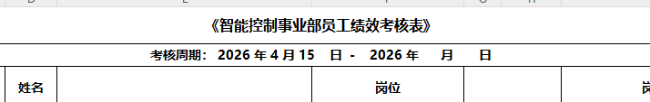
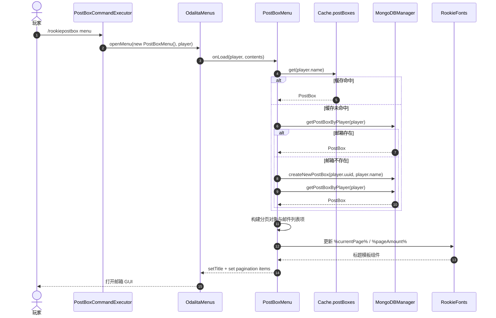
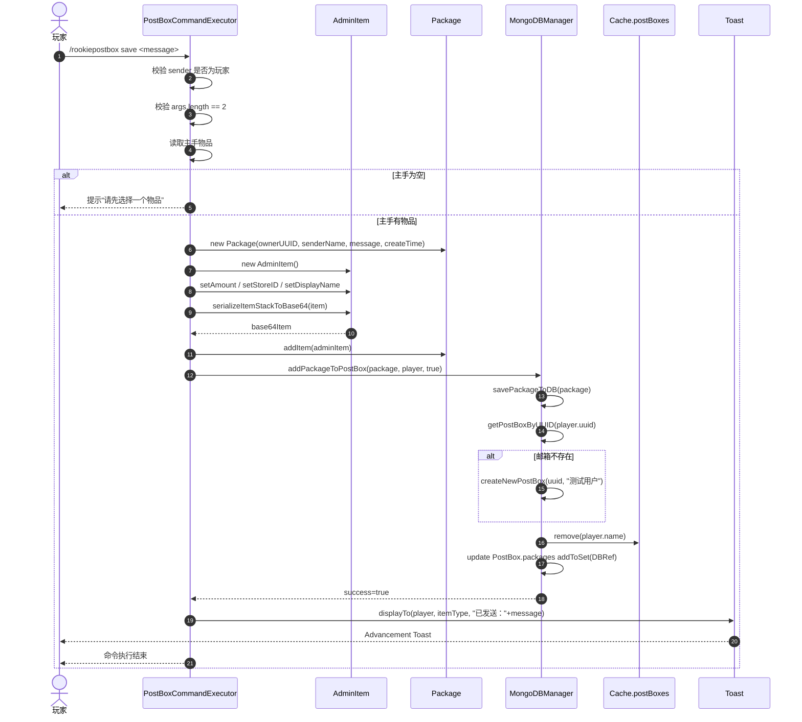
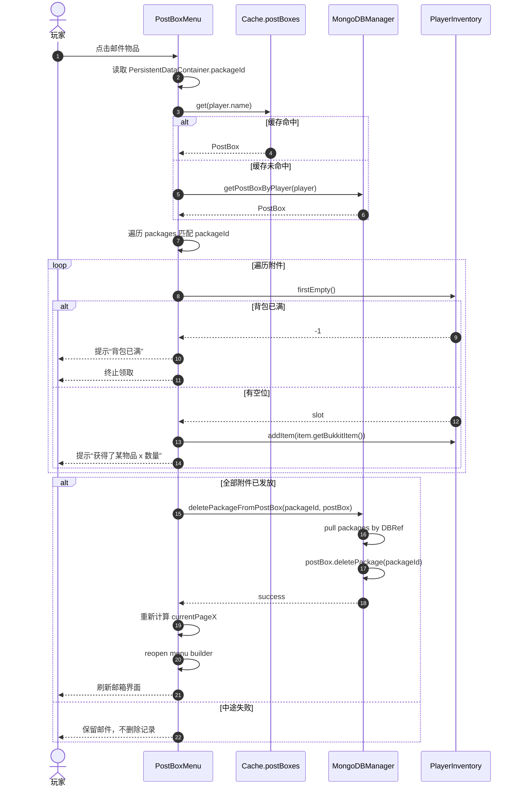
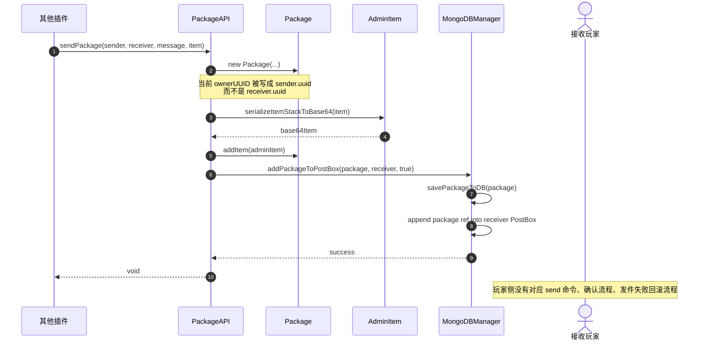
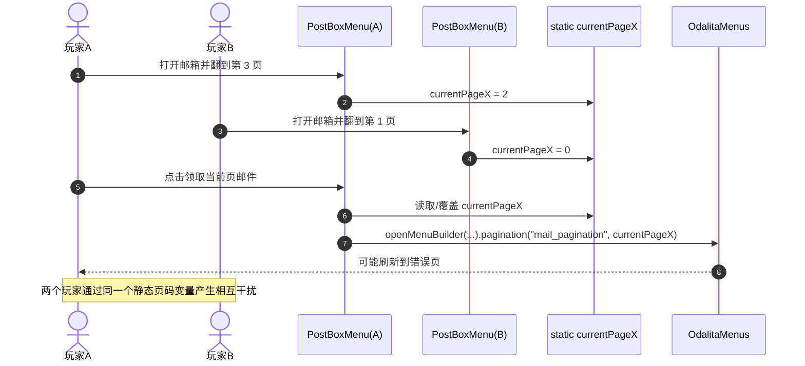
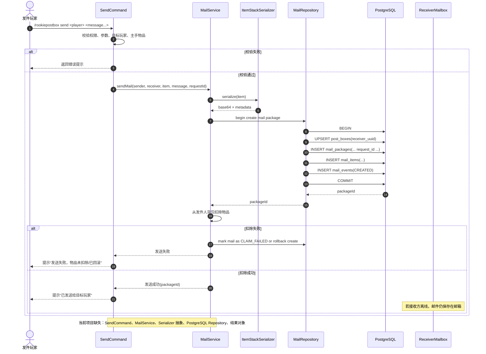
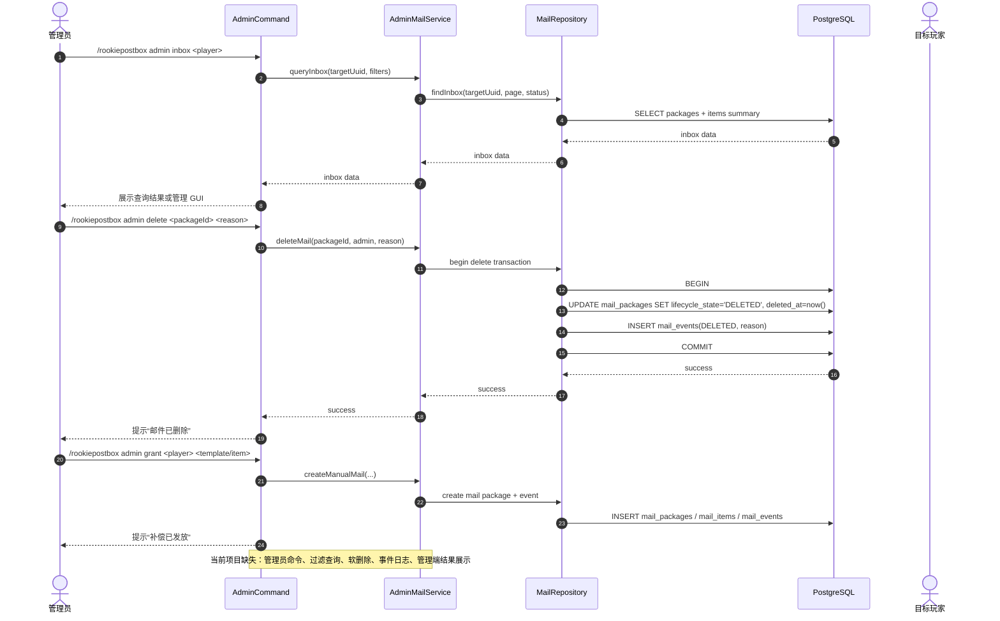
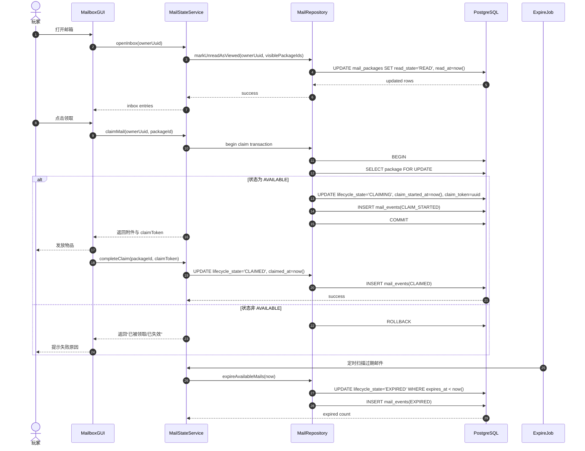
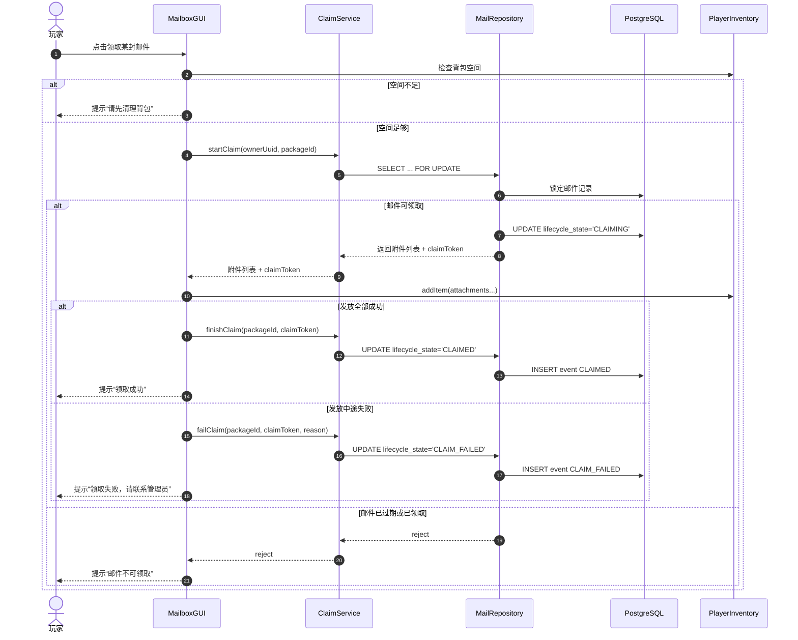

# RookiePostBox 业务时序图

## 1. 文档说明

这份文档基于当前项目代码结构和功能盘点文档，按三个阶段组织业务时序图：

1. 原型稳定性阶段
2. 玩家发件功能阶段
3. 正式服能力阶段

文档目标不是只画“理想流程”，而是同时覆盖：

- 当前已实现的核心链路
- 当前半成品链路和脆弱点
- 尚未实现但必须补齐的目标链路

每张时序图后都附带关键问题分析，重点标出：

- 缺失组件
- 事务边界
- 全局静态状态风险
- 并发和幂等问题
- 错误反馈路径

---

## 2. 阶段一：原型稳定性

这一阶段的目标不是继续堆功能，而是把现有闭环梳理清楚，并暴露当前实现中的薄弱点。

---

## 2.1 已实现：玩家打开邮箱菜单

**问题分析**
- 当前流程没有真正稳定的缓存命中路径，大多数情况下仍然直接回数据库。
- `Cache.postBoxes` 的 key 使用不一致，代码里既有 `player.name`，也有 `uuid` 方向的清理逻辑，缓存语义不稳定。
- `createNewPostBox` 与后续查询没有事务封装。如果未来改成 PostgreSQL，这里应改为 `createIfAbsent` 或 `upsert`。
- 标题刷新耦合 `RookieFonts` 占位符更新，GUI 数据加载和标题系统耦合过深。

---

## 2.2 已实现：玩家保存主手物品到邮箱

**问题分析**
- 当前这个“save”并不是发给别人，而是把邮件存进玩家自己的邮箱，本质上更像“自投递”。
- `args.length == 2` 导致消息不能带空格，命令参数设计不完整。
- 当前没有事务边界。`savePackageToDB` 成功但 `PostBox` 引用更新失败时，会出现孤立包裹。
- 当前使用 Mongo `DBRef + addToSet`，对“单封邮件 + 附件 + 邮箱关系”的一致性没有完整保障。
- `Cache.remove(player.name)` 是写后失效，但没有统一的读写策略。
- 玩家物品不会从背包扣除，因此它更像“复制入邮箱”，不是正式服可接受的发件流程。

---

## 2.3 已实现：玩家领取邮件物品

**问题分析**
- 当前流程先发物品，再删数据库记录，中间没有事务保护。如果服务器在“发完物品但还没删记录”时崩溃，会导致重复领取。
- 当前删除逻辑是“领完直接删”，没有 `已领取` 状态，也没有审计记录。
- 当前领取动作完全运行在 GUI 回调中，没有服务层，不利于后续迁移 PostgreSQL 和加锁。
- 这里没有全局锁或行级锁概念。两次快速点击、双开窗口、插件异步影响都可能造成重复领取风险。
- `currentPageX` 是静态变量，菜单刷新时可能被其他玩家操作污染。

---

## 2.4 半成品：API 发件功能当前状态

**问题分析**
- API 已经具备“对别人发件”的雏形，但语义有 bug，`ownerUUID` 字段当前构造错误。
- API 返回 `void`，调用方拿不到明确的结果对象、包裹 ID、失败原因。
- 当前没有幂等字段，其他插件重复调用时可能重复投递。
- 玩家侧完全缺少对应命令和确认流程，所以这条链路只适合内部测试，不适合真实业务接入。

---

## 2.5 半成品：GUI 并发脆弱点

**问题分析**
- `currentPageX` 是全局静态状态，不是会话状态。它天然不适合多人并发。
- 正确做法应该是“每个玩家会话独立页码”，归属到 `MenuSession`、`Pagination` 或服务层状态对象。
- 当前没有“全局锁”的正确使用场景。这里不应该加全局锁，而应该移除全局共享变量。
- 真正需要锁的是“领取同一封邮件”这种业务资源，不是分页 UI。

---

## 3. 阶段二：玩家发件功能

这一阶段的目标是从“自投递原型”升级为真正的玩家间邮件系统。

---

## 3.1 预期：玩家间邮件发送完整流程

**问题分析**
- 这条链路必须引入 `requestId`，否则命令重试、插件重复回调、网络抖动都可能造成重复投递。
- “写库”和“扣玩家物品”不在同一个数据库事务里，因为 Bukkit 背包操作不属于数据库资源，所以必须设计补偿逻辑。
- 比较稳妥的方式是：
  - 先校验并锁定发件动作
  - 成功写库
  - 再扣除物品
  - 失败时补偿删除邮件或将邮件标记异常
- 这里不应该用全局锁锁住整个插件，只应该针对“发件玩家背包操作”和“requestId 幂等键”做局部保护。

---

## 4. 阶段三：正式服能力

这一阶段关注管理员、状态系统、审计和可恢复性。

---

## 4.1 预期：管理员管理功能交互流程

**问题分析**
- 管理员删除不应物理删除附件和事件，至少首选软删除。
- 管理员查询会推动索引设计，必须支持：
  - `owner_uuid + status + created_at`
  - `sender_uuid + created_at`
  - `package_id + event_time`
- 正式服下，管理员操作必须有事件审计，否则删件和补偿会变成黑盒。

---

## 4.2 预期：邮件状态管理系统工作流程

**问题分析**
- 这里真正需要的是“行级锁”或同等语义，而不是 JVM 级全局锁。锁的对象应该是单封邮件记录。
- 读取和状态切换必须由服务层驱动，GUI 不能直接访问数据库。
- `CLAIMING -> CLAIMED` 是为了解决“发物品”和“改状态”不在同一事务的问题。
- 如果发物品失败，应有 `CLAIM_FAILED` 或重试恢复逻辑，而不是简单回滚数据库。

---

## 4.3 预期：正式服安全领取流程

**问题分析**
- 这是 PostgreSQL 版本最核心的事务图。没有这条链路，正式服版本不成立。
- 背包空间校验应该尽量前置，但最终仍要容忍中途失败，因为附件可能多件、Bukkit 行为可能异常。
- 不建议使用插件级全局互斥锁锁整个领取系统，那会放大延迟和阻塞。正确做法是“按邮件 ID 做数据库锁定或细粒度互斥”。

---

## 5. 分阶段缺失组件清单

### 阶段一：原型稳定性

缺失或不稳部分：

- 配置文件化数据库连接
- 统一缓存键策略
- 移除 `currentPageX` 静态页码
- 服务层抽象
- 结果对象和错误码

### 阶段二：玩家发件功能

缺失部分：

- `send` 命令
- 发件确认流程
- 目标玩家解析与离线支持
- 发件成功后的物品扣除逻辑
- 发件幂等键

### 阶段三：正式服能力

缺失部分：

- PostgreSQL repository
- 事务化领取流程
- 邮件状态机
- 管理员命令与查询能力
- 审计事件表
- 过期任务和恢复机制

---

## 6. 一句话结论

当前项目已经有了三个真实存在的时序主干：

- 打开邮箱
- 保存邮件
- 领取附件

但它们都还停留在“GUI 和数据库直接耦合”的原型形态。下一版如果要迁移到 PostgreSQL 并迈向正式服，必须把这些时序重构为：

- 命令 / GUI
- 服务层
- 事务化仓储层
- 状态机与审计层

这样的分层交互。
