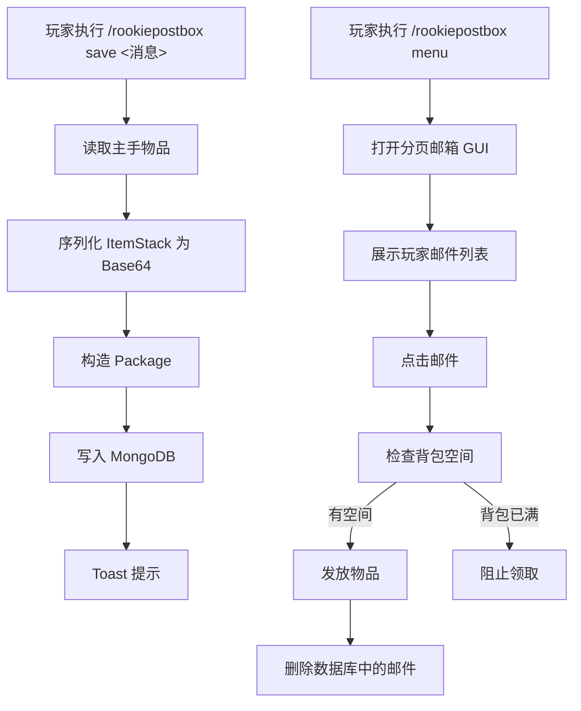

# RookiePostBox 功能盘点与路线图

## 1. 当前定位

`RookiePostBox` 目前已经具备一个基础“物品邮箱”原型：

- 玩家可以打开邮箱 GUI
- 玩家可以把主手物品保存为一封邮件
- 邮件会被持久化到数据库
- 玩家可以在邮箱中领取邮件里的物品
- 领取后会从数据库中删除该邮件

它已经不是空壳，但距离“正式可上线插件”还有一段距离。当前更准确的定位是：

> 已完成核心闭环的原型插件，而不是完整的生产级邮箱系统。

---

## 2. 当前功能结构

---

## 3. 已实现

### 3.1 插件启动与依赖接入

- 已注册主命令 `RookiePostBox`
- 已接入 `OdalitaMenus`
- 已接入 `RookieFonts`
- 启动时自动连接本地 MongoDB

对应代码：

- `src/main/resources/plugin.yml`
- `src/main/java/com/cuzz/rookiepostbox/RookiePostBox.java`

### 3.2 基础命令入口

当前命令入口已经可用：

- `/rookiepostbox menu`
  - 打开邮箱菜单
- `/rookiepostbox save <消息>`
  - 将主手物品保存为一封邮件

说明：

- 这里只支持一个参数形式的消息
- 也就是说当前消息不能自然支持空格拼接

对应代码：

- `src/main/java/com/cuzz/rookiepostbox/command/PostBoxCommandExecutor.java`

### 3.3 邮件数据模型

当前数据模型已经具备基本结构：

- `PostBox`
  - 一个玩家一个邮箱
  - 邮箱中持有多个 `Package`
- `Package`
  - 包含留言、时间、发送者、接收者、物品列表
- `AbstractItem / AdminItem / NonAdminItem`
  - 用于保存物品元信息与序列化结果

对应代码：

- `src/main/java/com/cuzz/rookiepostbox/model/PostBox.java`
- `src/main/java/com/cuzz/rookiepostbox/model/Package.java`
- `src/main/java/com/cuzz/rookiepostbox/model/item/*.java`

### 3.4 物品序列化与反序列化

当前已经完成：

- `ItemStack -> Base64`
- `Base64 -> ItemStack`

这意味着插件已经具备“把物品安全存库，再恢复到玩家背包”的核心能力。

对应代码：

- `src/main/java/com/cuzz/rookiepostbox/model/item/AbstractItem.java`

### 3.5 邮箱 GUI 与分页

当前已经完成一个基础分页 GUI：

- 6 行箱子菜单
- 每页 21 封邮件
- 支持上一页/下一页
- 支持动态页码标题
- 支持点击邮件领取

对应代码：

- `src/main/java/com/cuzz/rookiepostbox/menu/pagination/PostBoxMenu.java`
- `src/main/java/com/cuzz/rookiepostbox/menu/pagination/MailPageItem.java`

### 3.6 邮件领取流程

当前领取逻辑已经形成闭环：

- 玩家点击邮件
- 检查背包是否有空位
- 把附件发回玩家背包
- 删除数据库中的邮件引用

这部分已经是当前插件最完整的一段业务流程。

### 3.7 对外 API 雏形

已经有一个简单的外部 API：

- `sendPackage`
- `deletePackage`
- `getPackageIdsByPlayer`

这说明插件已经有作为“被其他插件调用”的方向。

对应代码：

- `src/main/java/com/cuzz/rookiepostbox/api/PackageAPI.java`

---

## 4. 半成品

这部分不是“完全没有”，而是“已经有轮廓，但还不够稳定或不够完整”。

### 4.1 发送能力只做了一半

当前插件内部确实有“发送包裹给别人”的 API 能力，但玩家侧还没有真正完成：

- 没有完整的玩家间发送命令
- 没有发件 GUI
- 没有收件人选择流程
- 没有发送确认流程

现状上更像：

- 命令层只支持“存自己邮箱”
- API 层才支持“发给别人”

### 4.2 GUI 交互可用，但实现还偏脆弱

当前 GUI 虽然能跑，但存在明显原型痕迹：

- `currentPageX` 是静态变量，容易在多人并发时互相影响
- `cacheMenu` 只声明未真正形成可靠缓存体系
- 标题刷新依赖外部字体占位符更新，耦合较重
- 菜单标题仍是 `Pagination Example` 这样的开发期命名

### 4.3 数据库接入可用，但配置方式还不合格

当前数据库直接写死：

- 地址：`mongodb://localhost:27017`
- 数据库名：`RookiePostBox`

这会带来几个问题：

- 无法通过配置文件切换环境
- 无法给服主自定义数据库账号密码
- 无法做连接池、超时、重试策略配置

### 4.4 邮件内容展示还比较粗糙

当前 GUI 中邮件展示信息已经有：

- 留言
- 发送时间
- 第一件物品名称与数量

但仍然不完整：

- 多附件展示不完整
- 没有已读/未读状态
- 没有邮件类型区分
- 没有过期信息
- 没有发送来源标记

### 4.5 Cache 设计没有真正落地

虽然有 `Cache.postBoxes`，但当前使用不一致：

- 有时按 `uuid`
- 有时按 `player name`
- 大部分读操作还是直接回数据库

这说明缓存策略还停留在尝试阶段，没有稳定成为架构的一部分。

### 4.6 API 已有雏形，但语义还不够严谨

例如 `PackageAPI#sendPackage` 中，构造 `Package` 时把 `ownerUUID` 设成了发送者 UUID，而不是接收者 UUID。

这说明：

- API 方向是对的
- 但还没有经过正式梳理和校验

---

## 5. 未实现

下面这些能力，当前代码中基本还没有真正完成。

### 5.1 正式服可用的配置系统

缺少：

- `config.yml`
- 数据库配置
- 调试开关
- GUI 文案配置
- 模型材质配置
- 分页大小配置

### 5.2 完整的玩家发件系统

缺少：

- `/rookiepostbox send <玩家> <消息>`
- GUI 选人发件
- 邮件发送确认
- 扣除物品与失败回滚
- 离线玩家投递

### 5.3 邮件状态系统

缺少：

- 未读
- 已读
- 已领取
- 已退回
- 已过期

### 5.4 管理员工具

缺少：

- 管理员查询某玩家邮箱
- 强制删除邮件
- 批量补发
- 手动投递系统奖励
- 日志审计

### 5.5 数据可靠性机制

缺少：

- 事务边界设计
- 幂等保护
- 异常恢复
- 重复领取防护
- 崩服中断后的补偿逻辑

### 5.6 自动化测试与回归验证

缺少：

- DAO 测试
- 序列化测试
- GUI 行为测试
- 并发领取测试
- 数据迁移测试

---

## 6. 关键问题判断

当前版本最核心的问题不是“功能太少”，而是“核心路径已经形成，但缺少工程化收口”。

换句话说，插件的主要风险是：

1. 架构和实现细节还偏原型
2. 数据层还不适合正式扩展
3. 发送链路没有形成完整玩家体验
4. 缺少配置、日志、事务、测试这些生产级能力

---

## 7. 建议路线图

### 阶段 1：把原型修成可稳定开发的 Beta

目标：

- 不追求一次做全
- 先把当前闭环做扎实

建议项：

- 把数据库连接改成配置文件读取
- 修正 `PackageAPI` 语义问题
- 去掉静态页码状态
- 统一缓存键策略
- 让消息支持多词拼接
- 给 GUI、物品模型、文案做基础配置

阶段结果：

- 形成“能持续迭代”的稳定版本

### 阶段 2：补全正式发件链路

目标：

- 玩家可以真正互相发件

建议项：

- 增加 `/rookiepostbox send <player> <message>`
- 支持离线玩家收件
- 加入发件确认
- 发送失败时回滚或不扣除物品
- 增加简单的发件日志

阶段结果：

- 插件从“自存邮箱原型”升级为“真实邮件插件”

### 阶段 3：重构数据层为 PostgreSQL

目标：

- 为长期维护和事务一致性做准备

建议项：

- 重新设计表结构
- 把“领取邮件”做成事务操作
- 增加状态字段而不是直接删除
- 为查询和统计预留索引

阶段结果：

- 数据层从“能存”升级为“可维护、可扩展、可审计”

### 阶段 4：做正式服能力

目标：

- 面向真实服务器环境

建议项：

- 管理员命令
- 批量邮件
- 过期清理
- 审计日志
- 性能优化
- 测试与回归体系

阶段结果：

- 达到可长期上线运行的插件标准

---

## 8. 推荐优先级

建议优先级顺序：

1. 先修稳定性和配置能力
2. 再补玩家可见的发件功能
3. 然后重构数据库层
4. 最后做管理端、审计和高级功能

---

## 9. 一句话结论

当前插件已经完成了“邮箱原型最核心的那一半”，下一步不该继续零散加功能，而应该先把：

- 数据层
- 状态管理
- 发送链路
- 配置能力

这四块收口，再进入正式版本开发。
