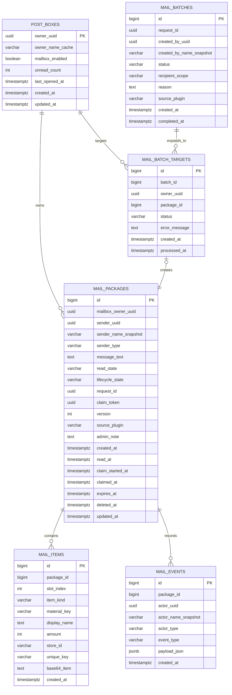

# RookiePostBox PostgreSQL ERD 设计

## 1. 设计目标

这份 ERD 以当前项目的 MongoDB 模型为基础，面向即将迁移到 PostgreSQL 的新版本 `RookiePostBox`。

设计目标：

- 保留现有核心概念：`PostBox`、`Package`、`Item`
- 按关系型数据库规范拆表
- 支持玩家间发件、管理员发件、系统/API 发件
- 同时支持“已读/未读”和“领取生命周期状态”
- 为事务、审计、幂等和批量发件预留结构

---

## 2. 现有 Mongo 模型到 PostgreSQL 的映射

### 2.1 `PostBox` -> `post_boxes`

现有模型中：

- 一个玩家对应一个邮箱
- `PostBox` 通过 `ownerUUID` 标识

迁移后：

- `post_boxes` 作为玩家邮箱主表
- 继续用玩家 UUID 作为稳定主键

### 2.2 `Package` -> `mail_packages`

现有模型中：

- `Package` 保存留言、发送者、接收者、创建时间、物品集合

迁移后：

- `mail_packages` 表示一封邮件
- 不再把邮件嵌在邮箱文档里，而是用逻辑关联字段指向邮箱

### 2.3 `AbstractItem / AdminItem / NonAdminItem` -> `mail_items`

现有模型中：

- 每封 `Package` 持有多个附件物品
- 物品本体以 Base64 方式存储
- `AdminItem` 额外有 `storeID`、`uniqueKey`

迁移后：

- `mail_items` 表示邮件附件
- 保留 `base64_item`
- 用 `item_kind` 区分普通物品与管理员物品

---

## 3. 设计原则

### 3.1 把“读状态”和“领取状态”分开

如果只保留一个状态字段，会遇到语义冲突：

- 一封邮件可能是“已读但未领取”
- 也可能是“未读但已过期”

因此建议拆成两列：

- `read_state`
  - `UNREAD`
  - `READ`
- `lifecycle_state`
  - `AVAILABLE`
  - `CLAIMING`
  - `CLAIMED`
  - `EXPIRED`
  - `DELETED`
  - `CLAIM_FAILED`

### 3.2 物理删除最少化

对邮件尽量不做直接物理删除，而是：

- 通过 `lifecycle_state` 标记状态
- 保留审计记录

这样更适合补偿、纠纷排查和失败恢复。

### 3.3 所有玩家身份统一围绕 UUID

- 玩家显示名只作为快照缓存
- 所有关系和查询主键都围绕 `uuid`

### 3.4 幂等保护要落到表结构

不能只靠代码约定。需要数据库层直接支持：

- 单封邮件请求幂等
- 批量发件请求幂等
- 领取流程的并发保护

### 3.5 不使用数据库外键，改为业务层约束

本版设计移除数据库级 `FOREIGN KEY` 约束，改为：

- 在业务层校验逻辑归属关系
- 通过事务控制写入顺序
- 通过唯一索引、状态字段和审计事件补足一致性

适用原则：

- 数据库只保存“关联 ID”
- 关联对象是否存在、是否属于当前玩家、是否允许当前操作，由 Service 层校验
- 删除父对象后的级联清理，改为业务层显式处理或后台任务补偿

这意味着：

- ERD 中的关系线表示“逻辑关系”，不表示数据库外键约束
- Java 服务层必须承担完整的数据完整性校验责任

---

## 4. 推荐枚举

建议在 PostgreSQL 中使用 `ENUM`，如果你更偏向迁移工具兼容，也可以改为 `VARCHAR + CHECK`。

### 4.1 `mail_read_state`

- `UNREAD`
- `READ`

### 4.2 `mail_lifecycle_state`

- `AVAILABLE`
- `CLAIMING`
- `CLAIMED`
- `EXPIRED`
- `DELETED`
- `CLAIM_FAILED`

### 4.3 `mail_sender_type`

- `PLAYER`
- `ADMIN`
- `SYSTEM`
- `PLUGIN`

### 4.4 `mail_item_kind`

- `NORMAL_ITEM`
- `ADMIN_ITEM`

### 4.5 `mail_event_type`

- `CREATED`
- `READ`
- `CLAIM_STARTED`
- `CLAIMED`
- `CLAIM_FAILED`
- `EXPIRED`
- `DELETED`
- `RESTORED`

### 4.6 `mail_batch_status`

- `PENDING`
- `RUNNING`
- `COMPLETED`
- `FAILED`
- `CANCELLED`

### 4.7 `mail_batch_target_status`

- `PENDING`
- `CREATED`
- `SKIPPED`
- `FAILED`

---

## 5. 实体关系图



SVG 版本：

- [diagram/rookiepostbox-postgresql-erd/rookiepostbox-postgresql-erd.svg](/abs/path/c:/Users/Administrator/Documents/GitHub/RookiePostBox/diagram/rookiepostbox-postgresql-erd/rookiepostbox-postgresql-erd.svg)

---

## 6. 核心表设计

## 6.1 `post_boxes`

用途：

- 表示玩家邮箱本体
- 承载玩家级邮箱配置与统计字段

建议字段：

- `owner_uuid UUID PRIMARY KEY`
- `owner_name_cache VARCHAR(32) NOT NULL`
- `mailbox_enabled BOOLEAN NOT NULL DEFAULT TRUE`
- `unread_count INTEGER NOT NULL DEFAULT 0`
- `last_opened_at TIMESTAMPTZ NULL`
- `created_at TIMESTAMPTZ NOT NULL DEFAULT NOW()`
- `updated_at TIMESTAMPTZ NOT NULL DEFAULT NOW()`

约束建议：

- `CHECK (unread_count >= 0)`

索引建议：

- `PRIMARY KEY (owner_uuid)`
- 可选：`INDEX idx_post_boxes_owner_name_cache (owner_name_cache)` 用于后台模糊查询

说明：

- `owner_name_cache` 仅是玩家名快照，不能作为业务主键

---

## 6.2 `mail_packages`

用途：

- 表示一封邮件
- 承载发件人、留言、状态、时间戳和幂等信息

建议字段：

- `id BIGSERIAL PRIMARY KEY`
- `mailbox_owner_uuid UUID NOT NULL`
- `sender_uuid UUID NULL`
- `sender_name_snapshot VARCHAR(32) NOT NULL DEFAULT ''`
- `sender_type mail_sender_type NOT NULL`
- `message_text TEXT NOT NULL DEFAULT ''`
- `read_state mail_read_state NOT NULL DEFAULT 'UNREAD'`
- `lifecycle_state mail_lifecycle_state NOT NULL DEFAULT 'AVAILABLE'`
- `request_id UUID NULL`
- `claim_token UUID NULL`
- `version INTEGER NOT NULL DEFAULT 0`
- `source_plugin VARCHAR(64) NULL`
- `admin_note TEXT NULL`
- `created_at TIMESTAMPTZ NOT NULL DEFAULT NOW()`
- `read_at TIMESTAMPTZ NULL`
- `claim_started_at TIMESTAMPTZ NULL`
- `claimed_at TIMESTAMPTZ NULL`
- `expires_at TIMESTAMPTZ NULL`
- `deleted_at TIMESTAMPTZ NULL`
- `updated_at TIMESTAMPTZ NOT NULL DEFAULT NOW()`

逻辑关联：

- `mailbox_owner_uuid` 在业务层指向 `post_boxes.owner_uuid`
- 删除玩家邮箱时，由业务层或离线清理任务显式处理其邮件数据

约束建议：

- `CHECK (version >= 0)`
- `CHECK (expires_at IS NULL OR expires_at > created_at)`
- `CHECK (claimed_at IS NULL OR claim_started_at IS NOT NULL)`

唯一约束建议：

- `UNIQUE (request_id)` where `request_id IS NOT NULL`
- `UNIQUE (claim_token)` where `claim_token IS NOT NULL`

索引建议：

- `INDEX idx_mail_packages_owner_inbox ON mail_packages(mailbox_owner_uuid, lifecycle_state, read_state, created_at DESC)`
- `INDEX idx_mail_packages_sender_uuid ON mail_packages(sender_uuid, created_at DESC)`
- `INDEX idx_mail_packages_expires_at ON mail_packages(expires_at) WHERE lifecycle_state IN ('AVAILABLE', 'CLAIMING')`
- `INDEX idx_mail_packages_state_created ON mail_packages(lifecycle_state, created_at DESC)`

设计说明：

- `request_id` 用于单封邮件的幂等发件
- `claim_token` 用于领取过程中的二阶段保护
- `version` 用于乐观锁或版本号更新

---

## 6.3 `mail_items`

用途：

- 表示一封邮件中的附件

建议字段：

- `id BIGSERIAL PRIMARY KEY`
- `package_id BIGINT NOT NULL`
- `slot_index INTEGER NOT NULL`
- `item_kind mail_item_kind NOT NULL`
- `material_key VARCHAR(64) NULL`
- `display_name TEXT NULL`
- `amount INTEGER NOT NULL`
- `store_id VARCHAR(128) NULL`
- `unique_key VARCHAR(128) NULL`
- `base64_item TEXT NOT NULL`
- `created_at TIMESTAMPTZ NOT NULL DEFAULT NOW()`

逻辑关联：

- `package_id` 在业务层指向 `mail_packages.id`
- 删除邮件时，由业务层显式清理附件

约束建议：

- `CHECK (slot_index >= 0)`
- `CHECK (amount > 0)`

唯一约束建议：

- `UNIQUE (package_id, slot_index)`
- 可选：`UNIQUE (unique_key) WHERE unique_key IS NOT NULL`

索引建议：

- `INDEX idx_mail_items_package_id ON mail_items(package_id, slot_index)`
- 可选：`INDEX idx_mail_items_store_id ON mail_items(store_id)`

设计说明：

- `material_key` 是给 GUI 和后台检索用的冗余字段
- `base64_item` 继续沿用当前项目的序列化方案，迁移成本最低
- `unique_key` 只对强唯一装备启用唯一约束时再使用

---

## 6.4 `mail_events`

用途：

- 保存邮件生命周期事件
- 满足审计、问题排查和管理员追踪

建议字段：

- `id BIGSERIAL PRIMARY KEY`
- `package_id BIGINT NOT NULL`
- `actor_uuid UUID NULL`
- `actor_name_snapshot VARCHAR(32) NOT NULL DEFAULT ''`
- `actor_type mail_sender_type NOT NULL`
- `event_type mail_event_type NOT NULL`
- `payload_json JSONB NOT NULL DEFAULT '{}'::jsonb`
- `created_at TIMESTAMPTZ NOT NULL DEFAULT NOW()`

逻辑关联：

- `package_id` 在业务层指向 `mail_packages.id`
- 删除或归档邮件时，由业务层同步处理事件记录

索引建议：

- `INDEX idx_mail_events_package_id_created_at ON mail_events(package_id, created_at DESC)`
- `INDEX idx_mail_events_actor_uuid_created_at ON mail_events(actor_uuid, created_at DESC)`
- `GIN INDEX idx_mail_events_payload_json ON mail_events USING GIN(payload_json)`

设计说明：

- `payload_json` 可以记录失败原因、旧状态、新状态、插件来源等上下文

---

## 6.5 `mail_batches`

用途：

- 为管理员批量发件和系统批量发奖提供批次主表

建议字段：

- `id BIGSERIAL PRIMARY KEY`
- `request_id UUID NULL`
- `created_by_uuid UUID NULL`
- `created_by_name_snapshot VARCHAR(32) NOT NULL DEFAULT ''`
- `status mail_batch_status NOT NULL DEFAULT 'PENDING'`
- `recipient_scope VARCHAR(32) NOT NULL`
- `reason TEXT NULL`
- `source_plugin VARCHAR(64) NULL`
- `created_at TIMESTAMPTZ NOT NULL DEFAULT NOW()`
- `completed_at TIMESTAMPTZ NULL`

唯一约束建议：

- `UNIQUE (request_id)` where `request_id IS NOT NULL`

索引建议：

- `INDEX idx_mail_batches_status_created_at ON mail_batches(status, created_at DESC)`

设计说明：

- `request_id` 用于批量任务的幂等保护
- `recipient_scope` 可以表达 `PLAYER_LIST`、`ALL_ONLINE`、`PERMISSION_GROUP`

---

## 6.6 `mail_batch_targets`

用途：

- 表示一个批量发件任务下的单个目标玩家
- 负责把批次和实际生成的单封邮件关联起来

建议字段：

- `id BIGSERIAL PRIMARY KEY`
- `batch_id BIGINT NOT NULL`
- `owner_uuid UUID NOT NULL`
- `package_id BIGINT NULL`
- `status mail_batch_target_status NOT NULL DEFAULT 'PENDING'`
- `error_message TEXT NULL`
- `created_at TIMESTAMPTZ NOT NULL DEFAULT NOW()`
- `processed_at TIMESTAMPTZ NULL`

逻辑关联：

- `batch_id` 在业务层指向 `mail_batches.id`
- `owner_uuid` 在业务层指向 `post_boxes.owner_uuid`
- `package_id` 在业务层指向 `mail_packages.id`
- 批次删除、目标清理、邮件回收都由业务层显式控制

唯一约束建议：

- `UNIQUE (batch_id, owner_uuid)`
- `UNIQUE (package_id)` where `package_id IS NOT NULL`

索引建议：

- `INDEX idx_mail_batch_targets_batch_status ON mail_batch_targets(batch_id, status)`
- `INDEX idx_mail_batch_targets_owner_uuid ON mail_batch_targets(owner_uuid, created_at DESC)`

设计说明：

- `UNIQUE (batch_id, owner_uuid)` 防止同一批次重复投递到同一玩家
- `package_id` 指向真正生成的邮件记录

---

## 7. 关系说明

### 7.1 `post_boxes` 1 : N `mail_packages`

- 一个玩家邮箱可以包含多封邮件
- 每封邮件必须在业务层校验属于一个邮箱

### 7.2 `mail_packages` 1 : N `mail_items`

- 一封邮件可以有多个附件
- 每个附件只能在业务层归属到一封邮件

### 7.3 `mail_packages` 1 : N `mail_events`

- 一封邮件在生命周期内可以产生多条事件日志，事件归属由业务层维护

### 7.4 `mail_batches` 1 : N `mail_batch_targets`

- 一个批次可以展开成多个目标玩家投递任务

### 7.5 `post_boxes` 1 : N `mail_batch_targets`

- 一个玩家可以成为多个批量发件任务的目标

### 7.6 `mail_batch_targets` 0..1 : 1 `mail_packages`

- 一个批量目标最终可能在业务层关联到一封邮件
- 如果生成失败，`package_id` 可以为空

---

## 8. 业务层约束规则

移除外键后，以下约束必须由 Service 层显式保证。

### 8.1 邮箱存在性约束

- 创建邮件前必须先 `createIfAbsent(ownerUuid)` 或确认邮箱存在
- 查询和写入都不得假设数据库自动保证邮箱存在

### 8.2 邮件归属约束

- 读取邮件详情时，必须同时校验 `package.mailbox_owner_uuid == ownerUuid`
- 管理员越权查询也必须经过权限和目标玩家校验

### 8.3 附件归属约束

- 读取附件时必须使用 `package_id` 查询，并校验该 `package_id` 属于目标邮件
- 禁止单独暴露按附件 ID 任意读取的危险接口

### 8.4 事件归属约束

- 记录事件前必须确认 `package_id` 合法存在
- 删除或归档邮件时，事件表需要同步清理或归档

### 8.5 批量任务归属约束

- 创建 `mail_batch_targets` 前必须确认 `batch_id` 合法
- 写入 `package_id` 前必须确认该邮件确实由该批次生成

### 8.6 删除级联约束

数据库不再做级联删除，因此业务层必须显式定义删除顺序：

1. 归档或删除 `mail_events`
2. 删除 `mail_items`
3. 更新或删除 `mail_packages`
4. 清理 `mail_batch_targets` 对应引用
5. 最后处理 `post_boxes` 或 `mail_batches`

---

## 9. 事务与幂等设计

## 9.1 单封邮件创建事务

建议事务步骤：

1. `INSERT ... ON CONFLICT DO NOTHING` 或先 `UPSERT` `post_boxes`
2. 以 `request_id` 做幂等校验
3. 创建 `mail_packages`
4. 创建 `mail_items`
5. 写入 `mail_events.CREATED`

这样可以保证：

- 玩家邮箱存在
- 同一个请求不会重复创建两封邮件

## 9.2 邮件领取事务

建议使用两阶段状态流转：

1. `SELECT ... FOR UPDATE` 锁定 `mail_packages`
2. 校验 `mailbox_owner_uuid`、`lifecycle_state = AVAILABLE`
3. 更新为 `CLAIMING`，写入 `claim_token`
4. 提交后执行 Bukkit 发物品
5. 成功则更新为 `CLAIMED`
6. 失败则更新为 `CLAIM_FAILED`

需要它的字段：

- `lifecycle_state`
- `claim_token`
- `version`
- `claim_started_at`
- `claimed_at`

## 9.3 批量发件幂等

幂等保护点：

- `mail_batches.request_id`
- `mail_batch_targets(batch_id, owner_uuid)` 唯一约束

这能避免：

- 同一个管理员批次重复创建
- 同一个批次给同一玩家重复发放

---

## 10. 管理员功能扩展支持

这套 ERD 已经为管理员相关能力预留了结构：

- `mail_events`
  - 查询谁发的、谁删的、何时领的
- `mail_batches`
  - 支持批量补偿、全服奖励、权限组奖励
- `mail_batch_targets`
  - 支持逐个玩家检查批量投递结果
- `admin_note`
  - 可记录补偿理由、工单号、活动名

如果后续你要做更强的运营后台，可以继续加：

- `admin_actions`
- `mail_templates`
- `mail_tags`

但对当前版本来说不是必须表。

---

## 11. 推荐 SQL 骨架

下面这段只给主键、逻辑关联字段和关键唯一约束，不展开所有枚举定义：

```sql
CREATE TABLE post_boxes (
    owner_uuid UUID PRIMARY KEY,
    owner_name_cache VARCHAR(32) NOT NULL,
    mailbox_enabled BOOLEAN NOT NULL DEFAULT TRUE,
    unread_count INTEGER NOT NULL DEFAULT 0 CHECK (unread_count >= 0),
    last_opened_at TIMESTAMPTZ,
    created_at TIMESTAMPTZ NOT NULL DEFAULT NOW(),
    updated_at TIMESTAMPTZ NOT NULL DEFAULT NOW()
);

CREATE TABLE mail_packages (
    id BIGSERIAL PRIMARY KEY,
    mailbox_owner_uuid UUID NOT NULL,
    sender_uuid UUID,
    sender_name_snapshot VARCHAR(32) NOT NULL DEFAULT '',
    sender_type VARCHAR(16) NOT NULL,
    message_text TEXT NOT NULL DEFAULT '',
    read_state VARCHAR(16) NOT NULL DEFAULT 'UNREAD',
    lifecycle_state VARCHAR(16) NOT NULL DEFAULT 'AVAILABLE',
    request_id UUID,
    claim_token UUID,
    version INTEGER NOT NULL DEFAULT 0 CHECK (version >= 0),
    source_plugin VARCHAR(64),
    admin_note TEXT,
    created_at TIMESTAMPTZ NOT NULL DEFAULT NOW(),
    read_at TIMESTAMPTZ,
    claim_started_at TIMESTAMPTZ,
    claimed_at TIMESTAMPTZ,
    expires_at TIMESTAMPTZ,
    deleted_at TIMESTAMPTZ,
    updated_at TIMESTAMPTZ NOT NULL DEFAULT NOW(),
    CHECK (expires_at IS NULL OR expires_at > created_at),
    CHECK (claimed_at IS NULL OR claim_started_at IS NOT NULL)
);

CREATE UNIQUE INDEX uq_mail_packages_request_id
    ON mail_packages(request_id)
    WHERE request_id IS NOT NULL;

CREATE UNIQUE INDEX uq_mail_packages_claim_token
    ON mail_packages(claim_token)
    WHERE claim_token IS NOT NULL;

CREATE TABLE mail_items (
    id BIGSERIAL PRIMARY KEY,
    package_id BIGINT NOT NULL,
    slot_index INTEGER NOT NULL CHECK (slot_index >= 0),
    item_kind VARCHAR(16) NOT NULL,
    material_key VARCHAR(64),
    display_name TEXT,
    amount INTEGER NOT NULL CHECK (amount > 0),
    store_id VARCHAR(128),
    unique_key VARCHAR(128),
    base64_item TEXT NOT NULL,
    created_at TIMESTAMPTZ NOT NULL DEFAULT NOW(),
    UNIQUE (package_id, slot_index)
);
```

---

## 12. 一句话结论

如果以当前项目为基线，这套 PostgreSQL ERD 最关键的设计点有四个：

1. `PostBox / Package / Item` 拆成标准 1:N 关系
2. `已读/未读` 和 `领取生命周期` 分离建模
3. 用 `request_id + claim_token + version` 支持幂等与并发保护
4. 取消数据库外键，改由 Service 层显式维护归属、级联和一致性
