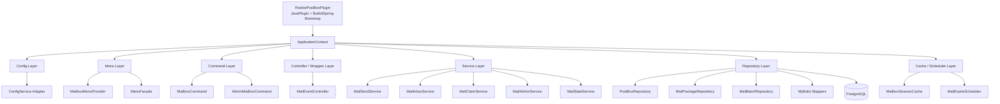
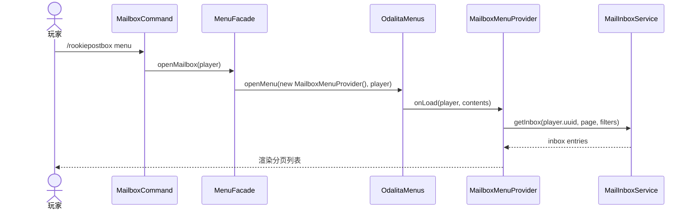

# RookiePostBox PostgreSQL 迁移开发文档

## 1. 文档目标

这份文档不是泛泛的迁移说明，而是基于以下三类现成框架文档，为 `RookiePostBox` 产出一份可直接指导开发的 PostgreSQL 迁移实施方案：

- `BukkitSpring` 插件框架文档
- `OdalitaMenus` 菜单 GUI 集成文档
- `DESIGN_PATTERNS.md` 中总结的通用 Bukkit 插件分层与设计模式

目标是把当前 `RookiePostBox` 从：

- 直接 `JavaPlugin` 生命周期
- 直接操作 MongoDB
- 命令 / GUI 直接耦合数据库
- 静态分页状态

迁移到：

- `BukkitSpring` 容器驱动
- PostgreSQL + MyBatis Starter
- Service / Repository 分层
- 菜单层只做展示和交互转发
- 业务层负责约束、事务和幂等

---

## 2. 参考约束

本方案以你给出的本地文档为前提，不另起一套风格。

### 2.1 来自 BukkitSpring 的约束

核心约束：

- 插件生命周期应接入 `BukkitSpring.registerPlugin(...)`
- Bean 管理采用 `@Component / @Service / @Repository / @Controller / @Configuration`
- 推荐构造器注入
- 可通过 `BukkitSpring.getGlobalBean(...)` 获取 starter 暴露的全局 Bean
- `Mybatis Starter` 已能提供 PostgreSQL 驱动、`MybatisService` 和 `SqlSessionFactory`
- `Config Starter` 可负责配置加载、缓存、失效与热重载

### 2.2 来自 OdalitaMenus 集成指南的约束

核心约束：

- 插件侧只需要声明 `depend: [OdalitaMenus]`
- 菜单打开通过 `OdalitaMenus.openMenu(...)` 或 `openMenuBuilder(...)`
- 菜单 Provider 应专注于 `onLoad(...)` 内容构建
- 运行期状态应该放在 `MenuSession` 或业务状态对象中，不应依赖全局静态变量

### 2.3 来自 DESIGN_PATTERNS.md 的约束

核心约束：

- 采用清晰的分层架构
- 采用依赖注入
- Service 层承载业务逻辑
- DAO / Repository 层承载持久化
- Cache 层只做线程安全缓存
- Scheduler / Task 负责后台任务
- Wrapper / Controller 用于事件转发和调度

---

## 3. 当前项目与目标形态的差距

当前 `RookiePostBox` 的现状：

- 主类 [RookiePostBox.java](/abs/path/c:/Users/Administrator/Documents/GitHub/RookiePostBox/src/main/java/com/cuzz/rookiepostbox/RookiePostBox.java:13) 直接负责命令注册、菜单系统初始化、MongoDB 初始化
- 命令类 [PostBoxCommandExecutor.java](/abs/path/c:/Users/Administrator/Documents/GitHub/RookiePostBox/src/main/java/com/cuzz/rookiepostbox/command/PostBoxCommandExecutor.java:21) 直接序列化物品并写库
- 菜单类 [PostBoxMenu.java](/abs/path/c:/Users/Administrator/Documents/GitHub/RookiePostBox/src/main/java/com/cuzz/rookiepostbox/menu/pagination/PostBoxMenu.java:41) 直接查询数据库、发物品、删除记录
- 数据层是 `MongoDBManager + Dao`
- 没有 Service 层
- 没有 PostgreSQL
- 没有 `BukkitSpring` Bean 容器
- 没有 starter 驱动的配置体系

目标版本的核心变化：

1. 生命周期改为 `BukkitSpring`
2. MongoDBManager 被 PostgreSQL Repository 替换
3. 命令和 GUI 改为只调用 Service
4. 菜单分页状态移到会话级状态
5. 数据完整性改为业务层约束
6. 领取流程改为事务化状态流转

---

## 4. 目标总体架构



---

## 5. 生命周期接入方案

按照 `BukkitSpring` 文档，目标主类不再自己 new 全部依赖，而是只负责容器启动和插件级入口。

### 5.1 目标主类

建议新增主类：

- `com.cuzz.rookiepostbox.RookiePostBoxPlugin`

职责：

- `onLoad()` 中注册 `BukkitSpring`
- `onEnable()` 中刷新容器
- `onDisable()` 中注销容器

建议形态：

```java
public final class RookiePostBoxPlugin extends JavaPlugin {
    private ApplicationContext context;

    @Override
    public void onLoad() {
        context = BukkitSpring.registerPlugin(this, "com.cuzz.rookiepostbox");
    }

    @Override
    public void onEnable() {
        context.refresh();
    }

    @Override
    public void onDisable() {
        BukkitSpring.unregisterPlugin(this);
    }
}
```

### 5.2 初始化顺序

遵循 `DESIGN_PATTERNS.md` 的初始化思想，但把创建动作交给容器：

1. 插件主类注册容器
2. `@Configuration` 装配基础 Bean
3. Starter 暴露的全局 Bean 可被注入
4. `@Service` / `@Repository` / `@Controller` 单例初始化
5. `@PostConstruct` 中完成命令注册、监听器注册、调度器启动

---

## 6. 目标包结构

建议新版本采用下面的包结构：

```text
com.cuzz.rookiepostbox
├─ RookiePostBoxPlugin.java
├─ config
│  ├─ RookiePostBoxConfiguration.java
│  ├─ RookiePostBoxProperties.java
│  ├─ MenuProperties.java
│  └─ DatabaseProperties.java
├─ bootstrap
│  ├─ PluginBootstrap.java
│  ├─ CommandRegistrar.java
│  └─ ListenerRegistrar.java
├─ command
│  ├─ MailboxCommand.java
│  ├─ MailboxCommandExecutor.java
│  └─ AdminMailboxCommandExecutor.java
├─ menu
│  ├─ facade
│  │  └─ MenuFacade.java
│  ├─ provider
│  │  ├─ MailboxMenuProvider.java
│  │  ├─ MailDetailMenuProvider.java
│  │  └─ AdminMailboxMenuProvider.java
│  ├─ model
│  │  └─ MenuMailView.java
│  └─ session
│     └─ MailboxSessionState.java
├─ controller
│  ├─ PlayerJoinController.java
│  ├─ InventoryController.java
│  └─ MailAdminController.java
├─ service
│  ├─ MailSendService.java
│  ├─ MailInboxService.java
│  ├─ MailClaimService.java
│  ├─ MailAdminService.java
│  ├─ MailStateService.java
│  ├─ MailBatchService.java
│  ├─ ItemSerializationService.java
│  └─ AuditLogService.java
├─ repository
│  ├─ PostBoxRepository.java
│  ├─ MailPackageRepository.java
│  ├─ MailBatchRepository.java
│  ├─ mybatis
│  │  ├─ PostBoxMapper.java
│  │  ├─ MailPackageMapper.java
│  │  ├─ MailItemMapper.java
│  │  ├─ MailEventMapper.java
│  │  └─ MailBatchMapper.java
│  └─ impl
│     ├─ PostgresPostBoxRepository.java
│     ├─ PostgresMailPackageRepository.java
│     └─ PostgresMailBatchRepository.java
├─ domain
│  ├─ entity
│  ├─ dto
│  ├─ command
│  ├─ result
│  └─ enumtype
├─ cache
│  ├─ MailboxSessionCache.java
│  └─ UnreadCountCache.java
├─ scheduler
│  ├─ MailExpireScheduler.java
│  └─ MailRecoveryScheduler.java
├─ task
│  ├─ MailExpireTask.java
│  └─ MailRecoveryTask.java
└─ api
   ├─ RookiePostBoxApi.java
   └─ DefaultRookiePostBoxApi.java
```

### 6.1 分层职责

- `config`
  - 框架配置与业务配置适配
- `bootstrap`
  - 启动注册与生命周期粘合层
- `command`
  - 纯命令参数解析与转发
- `menu`
  - GUI 展示、点击转发、会话状态
- `controller`
  - Bukkit 事件监听与流程调度
- `service`
  - 业务约束、事务和幂等核心层
- `repository`
  - PostgreSQL 读写适配层
- `cache`
  - 线程安全会话和热点缓存
- `scheduler / task`
  - 后台清理与恢复任务
- `api`
  - 对其他插件暴露的稳定接口

---

## 7. 依赖方案

### 7.1 `plugin.yml`

迁移后建议：

```yaml
name: RookiePostBox
main: com.cuzz.rookiepostbox.RookiePostBoxPlugin
version: '${project.version}'
api-version: '1.20'
depend:
  - BukkitSpring
  - OdalitaMenus
commands:
  rookiepostbox:
    permission: rookiepostbox.use
```

### 7.2 Maven 方向

建议新增：

- `BukkitSpring`
- `bukkitspring-starter-mybatis`
- `bukkitspring-starter-config`
- 保留 `OdalitaMenus` provided 依赖
- PostgreSQL JDBC 由 `mybatis-starter` 处理

开发约束：

- 业务插件编译期以 `provided` 依赖这些框架
- 运行时由服务器 `plugins/` 与 `plugins/BukkitSpring/starters/` 提供

---

## 8. Starter 接入决策

## 8.1 必选：MyBatis Starter

为什么选它：

- `BukkitSpring` 文档里已经明确暴露 `MybatisService` 和 `SqlSessionFactory`
- 它已经支持 PostgreSQL
- 非常适合这类结构化邮件数据

建议使用方式：

- Repository 层通过 `MybatisService` 管理会话
- Mapper 接口放在 `repository.mybatis`
- SQL 先用注解或 XML 都可以，但推荐邮件查询走 XML

### 8.2 必选：Config Starter

为什么选它：

- 当前项目缺少统一配置体系
- 迁移后会新增数据库配置、菜单配置、状态配置、文案配置
- 文档中支持缓存、失效和热重载，适合菜单配置和插件配置分离

建议使用方式：

- `config.yml` 保留插件基础配置
- `menus/*.yml` 交给 `ConfigService`
- 管理员热重载时调用 `invalidate(...)`

### 8.3 暂不引入其他 Starter

当前迁移阶段不建议同时引入：

- Kafka
- Redis
- Redisson
- RocketMQ

原因很简单：

- PostgreSQL 迁移已经足够大
- 先保持存储链路单一

---

## 9. 配置结构建议

## 9.1 `config.yml`

```yaml
rookiepostbox:
  debug: false

  mail:
    page-size: 21
    default-expire-days: 30
    unread-on-open: true
    allow-player-send: false
    allow-offline-send: true

  claim:
    recover-claiming-after-seconds: 120
    enable-claim-failed-retry: true

  starter:
    use-config-service: true
    use-mybatis-service: true
```

## 9.2 MyBatis Starter 配置

```yaml
mybatis:
  enabled: true
  debug: false
  auto-commit: false

  jdbc-url: "jdbc:postgresql://127.0.0.1:5432/rookiepostbox?currentSchema=public"
  username: "postgres"
  password: "change_me"
  driver: "org.postgresql.Driver"

  pool:
    max-size: 10
    min-idle: 2
    connection-timeout-ms: 30000
    max-lifetime-ms: 1800000
    idle-timeout-ms: 600000

  log-impl: JDK_LOGGING
  slow-sql-threshold-ms: 200
```

## 9.3 Config Starter 配置

```yaml
config-starter:
  enabled: true
  virtual-threads: true

  source:
    strategy: local-first
    local:
      enabled: true
      bootstrap-from-resource: true
      encoding: UTF-8

  cache:
    enabled: true
    ttl-ms: 5000
    max-entries: 256
```

## 9.4 菜单配置目录

建议使用：

```text
src/main/resources/
├─ config.yml
├─ menus/
│  ├─ mailbox.yml
│  ├─ mail-detail.yml
│  └─ admin-mailbox.yml
└─ mappers/
   ├─ PostBoxMapper.xml
   ├─ MailPackageMapper.xml
   └─ MailBatchMapper.xml
```

---

## 10. Bean 设计

## 10.1 基础配置 Bean

建议新增：

- `RookiePostBoxConfiguration`
- `StarterBridgeConfiguration`
- `MenuConfiguration`
- `RepositoryConfiguration`

职责：

- 注入 `JavaPlugin`
- 获取 `MybatisService`
- 获取 `ConfigService`
- 获取 `OdalitaMenus`
- 暴露必要的 Facade Bean

## 10.2 菜单 Facade Bean

建议不要在所有命令和 Service 中直接碰 `OdalitaMenus`，而是加一层：

- `MenuFacade`

职责：

- 打开玩家邮箱菜单
- 打开邮件详情菜单
- 打开管理员查询菜单
- 统一从 `OdalitaMenus` 获取会话

这样做的原因：

- 降低对第三方 GUI API 的扩散依赖
- 更符合 `Facade` 模式

## 10.3 Service Bean

建议最少拆成下面几类：

- `MailSendService`
  - 发送邮件
- `MailInboxService`
  - 查询收件箱
- `MailClaimService`
  - 领取邮件
- `MailStateService`
  - 状态流转
- `MailAdminService`
  - 管理员查询、删除、补发
- `MailBatchService`
  - 批量发件
- `ItemSerializationService`
  - `ItemStack <-> Base64`

## 10.4 Repository Bean

建议 Repository 只承载数据行为，不做 Bukkit 对象逻辑：

- `PostBoxRepository`
- `MailPackageRepository`
- `MailBatchRepository`

Mapper 则更底层：

- `PostBoxMapper`
- `MailPackageMapper`
- `MailItemMapper`
- `MailEventMapper`
- `MailBatchMapper`

---

## 11. 菜单集成方案

## 11.1 菜单层边界

按照 `OdalitaMenus` 文档，菜单 Provider 应只承担：

- 根据 Service 返回的数据渲染内容
- 处理点击事件
- 把点击动作转发给 Service

明确禁止：

- 在 Provider 内直接写 SQL
- 在 Provider 内直接开事务
- 在 Provider 内直接维护全局静态分页状态

## 11.2 会话状态替代 `currentPageX`

当前项目的 `currentPageX` 是静态变量，必须移除。

建议改成：

- `MailboxSessionState`
  - `ownerUuid`
  - `currentPage`
  - `selectedPackageId`
  - `filters`
  - `lastRefreshAt`

状态存放位置建议：

- `MailboxSessionCache`
- 或 `MenuSession` 自身附加数据

不建议：

- `static int currentPageX`
- `Map<Player, ...>` 但无生命周期清理

## 11.3 菜单加载流程



## 11.4 菜单配置加载

如果使用 `ConfigService`，建议：

- `menus/mailbox.yml`
- `menus/mail-detail.yml`
- `menus/admin-mailbox.yml`

由 `MenuTemplateService` 或 `MenuConfigService` 统一解析。

这样后续：

- 材质
- 标题
- Lore
- 空槽位填充

都能配置化。

---

## 12. Repository 与 MyBatis 设计

## 12.1 Mapper 风格建议

建议：

- 简单写操作用注解
- 收件箱查询、管理员筛选、批量任务查询用 XML

原因：

- 复杂 SQL 早晚会出现
- XML 更适合分页和动态条件

## 12.2 Repository 层职责

Repository 层负责：

- 调用 `MybatisService`
- 打开会话
- 聚合多个 Mapper 调用
- 控制数据库事务提交/回滚

Repository 层不负责：

- 玩家背包校验
- 权限判断
- 菜单逻辑

## 12.3 无外键模式下的 Repository 规则

因为你已经决定移除数据库外键，所以 Repository 必须遵守：

1. 写入 `mail_items` 前必须先确认 `mail_packages` 已创建
2. 写入 `mail_events` 前必须先确认 `packageId` 合法
3. 删除邮件时必须显式清理：
   - `mail_items`
   - `mail_events`
   - `mail_batch_targets.package_id`
4. 删除邮箱时必须显式清理：
   - `mail_packages`
   - 附件
   - 事件

---

## 13. Service 设计

## 13.1 `MailSendService`

职责：

- 校验发件人
- 校验接收人
- 校验消息和附件
- 生成 `requestId`
- 调用 Repository 写入邮件和附件
- 处理物品扣除与失败补偿

## 13.2 `MailInboxService`

职责：

- 查询收件箱分页数据
- 组合菜单显示所需 DTO
- 更新未读数

## 13.3 `MailClaimService`

职责：

- 领取前归属校验
- 领取事务入口
- 生成 `claimToken`
- 协调 `CLAIMING -> CLAIMED / CLAIM_FAILED`

## 13.4 `MailAdminService`

职责：

- 管理员查询
- 手动补偿
- 删除异常邮件
- 批量任务入口

## 13.5 `MailStateService`

职责：

- 状态机规则集中管理
- 校验状态跳转是否合法

例如：

- `AVAILABLE -> CLAIMING`
- `CLAIMING -> CLAIMED`
- `CLAIMING -> CLAIM_FAILED`
- `AVAILABLE -> EXPIRED`

---

## 14. 事务设计

## 14.1 发件事务

推荐流程：

1. `createIfAbsent(receiverBox)`
2. 校验 `requestId` 是否已存在
3. 创建 `mail_packages`
4. 创建 `mail_items`
5. 创建 `mail_events.CREATED`
6. 提交数据库事务
7. 扣除玩家物品
8. 失败时补偿

注意：

- “写数据库”和“扣玩家背包”不是同一个数据库事务
- 因此必须准备补偿逻辑

## 14.2 领取事务

推荐流程：

1. 查询邮件并校验归属
2. `SELECT ... FOR UPDATE`
3. 校验状态为 `AVAILABLE`
4. 更新为 `CLAIMING`
5. 提交事务
6. Bukkit 主线程发物品
7. 成功后标记 `CLAIMED`
8. 失败后标记 `CLAIM_FAILED`

## 14.3 管理员删除事务

建议：

- 不直接物理删 `mail_packages`
- 优先改状态为 `DELETED`
- 写入 `mail_events.DELETED`

如果必须清理真实数据，则显式顺序删除。

---

## 15. Cache 与 Scheduler 设计

参考 `DESIGN_PATTERNS.md`，迁移版需要但不应该过度设计。

## 15.1 建议保留的 Cache

- `MailboxSessionCache`
  - 菜单会话状态
- `UnreadCountCache`
  - 玩家未读数量热点缓存

要求：

- 使用线程安全结构
- 有明确生命周期
- 不缓存数据库真值太久

## 15.2 建议新增的 Scheduler

- `MailExpireScheduler`
  - 定时过期 `AVAILABLE` 邮件
- `MailRecoveryScheduler`
  - 扫描长期停留在 `CLAIMING` 的记录

## 15.3 不建议现在加的东西

- 复杂二级缓存
- Redis 分布式锁
- 跨服消息总线

原因：

- 当前问题还在单插件内

---

## 16. API 设计

当前的 `PackageAPI` 不适合直接延续。

建议新 API：

```java
public interface RookiePostBoxApi {
    SendMailResult sendMail(SendMailCommand command);
    ClaimPreviewResult previewClaim(UUID ownerUuid, long packageId);
    InboxPageResult getInbox(UUID ownerUuid, int page, int size);
    AdminQueryResult queryInbox(UUID ownerUuid, MailQuery query);
}
```

设计要求：

- 不返回 `void`
- 返回结果对象
- 要带失败原因
- 要能支持幂等键

如果要给其他插件注入，建议在容器就绪后把 `RookiePostBoxApi` 注册为全局 Bean。

---

## 17. 开发顺序

## 17.1 第一阶段：框架接入

先做：

1. 主类切换到 `BukkitSpring`
2. 接入 `MyBatis Starter`
3. 接入 `Config Starter`
4. 建立新的包结构
5. 保持功能暂时不变

交付结果：

- 项目可以在容器中启动
- 能拿到 `MybatisService`
- 能加载配置

## 17.2 第二阶段：Repository 落地

再做：

1. 按 ERD 建 PostgreSQL 表
2. 建 Mapper
3. 建 Repository
4. 做邮箱查询和邮件创建

交付结果：

- PostgreSQL 可以读写 `post_boxes / mail_packages / mail_items`

## 17.3 第三阶段：Service 重构

再做：

1. 把命令逻辑搬进 Service
2. 把菜单点击逻辑搬进 Service
3. 引入状态机和事务

交付结果：

- GUI 与命令不再直接碰数据库

## 17.4 第四阶段：菜单重构

再做：

1. 移除静态页码
2. 引入会话状态
3. 菜单配置化

交付结果：

- 邮箱 GUI 可以稳定支撑多人并发

## 17.5 第五阶段：管理员与恢复能力

最后做：

1. 管理员查询
2. 删除与补偿
3. 过期任务
4. `CLAIM_FAILED` 恢复任务

交付结果：

- 到达正式服可用水平

---

## 18. 具体实施清单

### 18.1 基础改造

- 替换主类为 `RookiePostBoxPlugin`
- 修改 `plugin.yml` 增加 `BukkitSpring`
- 引入 `BukkitSpring` 与相关 starter 依赖
- 建立新的包结构

### 18.2 配置改造

- 补 `config.yml`
- 补 `mybatis` 配置
- 补 `config-starter` 配置
- 新建 `menus/*.yml`

### 18.3 数据层改造

- 新建 PostgreSQL DDL
- 新建 Mapper 接口和 XML
- 新建 Repository
- 去掉 `MongoDBManager`

### 18.4 业务层改造

- 新建 `MailSendService`
- 新建 `MailInboxService`
- 新建 `MailClaimService`
- 新建 `MailAdminService`
- 新建 `MailStateService`

### 18.5 菜单改造

- 重写 `PostBoxMenu`
- 新建 `MenuFacade`
- 新建会话状态对象
- 清除静态分页状态

### 18.6 API 改造

- 废弃当前 `PackageAPI`
- 新建 `RookiePostBoxApi`
- 返回结果对象而不是 `void`

---

## 19. 迁移期间的兼容建议

建议迁移期间不要同时保留 MongoDB 和 PostgreSQL 双写逻辑太久。

推荐顺序：

1. 先完成 PostgreSQL 版本代码
2. 做一次性迁移脚本
3. 切换到 PostgreSQL
4. 再移除 MongoDB 代码

原因：

- 双写会放大幂等、回滚和一致性复杂度

---

## 20. 一句话结论

基于你现有的 `BukkitSpring`、`OdalitaMenus` 和通用设计模式文档，`RookiePostBox` 的 PostgreSQL 迁移不应只是“把 Mongo 改成 PostgreSQL”，而应该同时完成四件事：

1. 用 `BukkitSpring` 重做生命周期和依赖注入
2. 用 `MyBatis Starter` 建立 PostgreSQL 持久化层
3. 用 `OdalitaMenus` 保持 GUI，但把数据库逻辑抽离到 Service
4. 用分层架构重建命令、菜单、事务、状态机和后台任务

这样迁移完成后，项目才会从原型插件真正进入可持续开发的正式结构。
