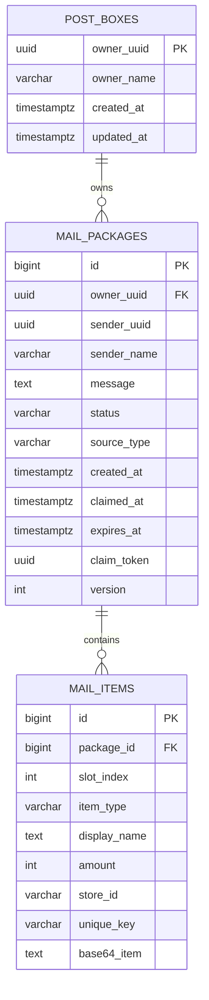
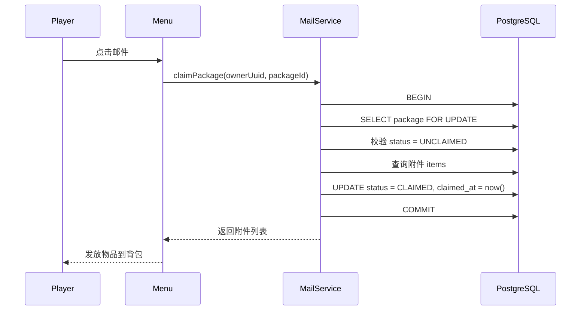
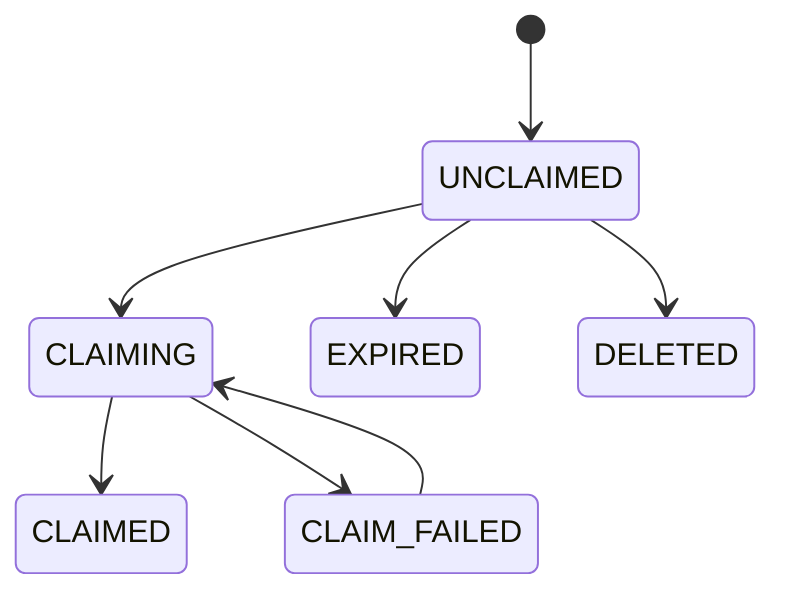
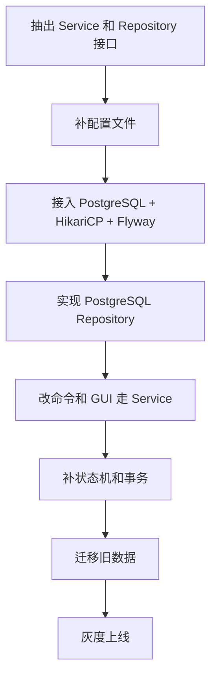

# RookiePostBox 从 MongoDB 迁移到 PostgreSQL 的方案

## 1. 目标

本方案的目标不是单纯“换数据库”，而是顺便把数据层从原型结构升级成适合正式插件维护的结构。

迁移后的目标能力：

- 数据结构清晰
- 支持事务
- 支持状态字段而不是直接删除
- 支持未来的审计、统计、批量投递、过期处理
- 降低业务代码和数据库实现的耦合

---

## 2. 为什么要迁移

当前 MongoDB 方案可以工作，但更适合原型阶段。对于这个插件的长期方向，PostgreSQL 更合理。

### 2.1 当前数据天然是关系型

核心关系实际上很简单：

- 一个玩家有一个邮箱
- 一个邮箱有多封邮件
- 一封邮件有多个附件物品

这就是非常标准的一对多关系，不是典型文档型场景。

### 2.2 领取流程需要事务

“领取邮件”不是简单读写，它实际是一个业务事务：

1. 查邮件是否存在且未领取
2. 反序列化附件
3. 发给玩家
4. 更新邮件状态
5. 记录领取时间

正式实现里，这些步骤应该被事务边界保护。

### 2.3 后续功能更依赖 SQL 能力

未来若要增加：

- 未读统计
- 按发送者查询
- 批量清理过期邮件
- 管理员后台检索
- 操作日志审计

PostgreSQL 会明显比当前 MongoDB 结构更顺手。

---

## 3. 先看当前 MongoDB 设计的问题

### 3.1 连接方式硬编码

当前数据库地址和数据库名写死在启动代码中：

- `mongodb://localhost:27017`
- `RookiePostBox`

这不适合发布给服务器服主使用。

### 3.2 `PostBox -> Package` 采用引用集合

当前是：

- `PostBox` 里保存 `Package` 引用
- 删除邮件时对引用做 `pull`

这虽然能跑，但有几个现实问题：

- 状态难扩展
- 查询维度有限
- 不利于审计
- 不利于做批量操作

### 3.3 领取即删除

当前逻辑中，玩家领取后直接删除邮件引用。

这样会损失：

- 已领取记录
- 审计能力
- 错误恢复能力

更合理的方式是：

- 保留邮件记录
- 使用状态位标记 `CLAIMED`

### 3.4 缓存与键设计不一致

当前缓存层有时按 `uuid`，有时按 `player name`。

迁移时应统一原则：

- 数据库主键与逻辑键一律围绕 `uuid`

---

## 4. 目标数据模型

我建议迁移后不要保留“Mongo 式引用邮箱文档”的设计，而改成标准关系模型。

### 4.1 表划分

建议使用 3 张核心表：

1. `post_boxes`
2. `mail_packages`
3. `mail_items`

如果后续要做审计，再补：

4. `mail_events`

---

## 5. 推荐表结构

### 5.1 `post_boxes`

用途：

- 表示玩家邮箱本体
- 为未来做偏好设置、容量设置、统计字段预留位置

```sql
CREATE TABLE post_boxes (
    owner_uuid      UUID PRIMARY KEY,
    owner_name      VARCHAR(32),
    created_at      TIMESTAMPTZ NOT NULL DEFAULT NOW(),
    updated_at      TIMESTAMPTZ NOT NULL DEFAULT NOW()
);
```

说明：

- `owner_uuid` 作为稳定主键
- `owner_name` 仅作展示缓存，不应作为业务主键

### 5.2 `mail_packages`

用途：

- 表示一封邮件

```sql
CREATE TABLE mail_packages (
    id                  BIGSERIAL PRIMARY KEY,
    owner_uuid          UUID NOT NULL REFERENCES post_boxes(owner_uuid) ON DELETE CASCADE,
    sender_uuid         UUID,
    sender_name         VARCHAR(32),
    message             TEXT NOT NULL DEFAULT '',
    status              VARCHAR(16) NOT NULL DEFAULT 'UNCLAIMED',
    source_type         VARCHAR(32) NOT NULL DEFAULT 'PLAYER',
    created_at          TIMESTAMPTZ NOT NULL DEFAULT NOW(),
    received_at         TIMESTAMPTZ,
    claimed_at          TIMESTAMPTZ,
    expires_at          TIMESTAMPTZ,
    claim_token         UUID,
    version             INTEGER NOT NULL DEFAULT 0
);

CREATE INDEX idx_mail_packages_owner_status_created
    ON mail_packages(owner_uuid, status, created_at DESC);

CREATE INDEX idx_mail_packages_sender_uuid
    ON mail_packages(sender_uuid);
```

建议状态枚举：

- `UNCLAIMED`
- `CLAIMED`
- `EXPIRED`
- `DELETED`
- `RETURNED`

### 5.3 `mail_items`

用途：

- 表示邮件附件

```sql
CREATE TABLE mail_items (
    id                  BIGSERIAL PRIMARY KEY,
    package_id          BIGINT NOT NULL REFERENCES mail_packages(id) ON DELETE CASCADE,
    slot_index          INTEGER NOT NULL,
    item_type           VARCHAR(16) NOT NULL,
    display_name        TEXT,
    amount              INTEGER NOT NULL,
    store_id            VARCHAR(128),
    unique_key          VARCHAR(128),
    base64_item         TEXT NOT NULL,
    created_at          TIMESTAMPTZ NOT NULL DEFAULT NOW()
);

CREATE INDEX idx_mail_items_package_id
    ON mail_items(package_id, slot_index);
```

说明：

- `item_type` 可存 `ADMIN` / `NON_ADMIN`
- `base64_item` 继续沿用当前序列化结果，迁移成本最低
- `slot_index` 让附件顺序可控

### 5.4 可选的 `mail_events`

如果你准备做正式服日志，建议加：

```sql
CREATE TABLE mail_events (
    id                  BIGSERIAL PRIMARY KEY,
    package_id          BIGINT NOT NULL,
    event_type          VARCHAR(32) NOT NULL,
    actor_uuid          UUID,
    actor_name          VARCHAR(32),
    payload_json        JSONB,
    created_at          TIMESTAMPTZ NOT NULL DEFAULT NOW()
);
```

事件示例：

- `CREATED`
- `CLAIMED`
- `EXPIRED`
- `DELETED_BY_ADMIN`

---

## 6. 目标数据关系图



---

## 7. DAO 设计怎么改

### 7.1 当前问题

当前 `Dao` 接口带有明显的 MongoDB 时代痕迹：

- `addPackageToPostBox`
- `deletePackageFromPostBox`
- `savePackageToDB`
- `savePostBoxToDB`

这些命名过于贴近底层存储动作，而不是业务语义。

### 7.2 建议改成“业务语义 DAO”

建议拆为 3 层：

1. `PostBoxRepository`
2. `MailPackageRepository`
3. `MailService`

其中：

- Repository 负责数据读写
- Service 负责事务和业务流程

### 7.3 推荐接口

```java
public interface PostBoxRepository {
    boolean exists(UUID ownerUuid);
    void createIfAbsent(UUID ownerUuid, String ownerName);
    Optional<PostBoxRecord> findByOwnerUuid(UUID ownerUuid);
}
```

```java
public interface MailPackageRepository {
    long createPackage(MailPackageRecord record, List<MailItemRecord> items);
    List<MailPackageRecord> findInbox(UUID ownerUuid, int page, int size);
    Optional<MailPackageDetail> findPackageDetail(long packageId);
    boolean markClaimed(long packageId, UUID ownerUuid, Instant claimedAt);
    boolean markExpired(long packageId, Instant expiredAt);
    boolean markDeleted(long packageId, UUID operatorUuid, Instant deletedAt);
}
```

```java
public interface MailService {
    long sendPackage(UUID senderUuid, String senderName, UUID receiverUuid, String message, List<ItemStack> items);
    ClaimResult claimPackage(UUID ownerUuid, long packageId);
    List<InboxEntry> getInbox(UUID ownerUuid, int page, int size);
}
```

### 7.4 设计原则

- Repository 不碰 Bukkit 业务对象时更干净
- `ItemStack` 与 Base64 转换最好收口在 mapper 或 serializer 组件中
- 事务不要散落在命令类和 GUI 类里

---

## 8. 事务边界怎么划

最重要的是“领取邮件”。

### 8.1 推荐领取流程



### 8.2 这里为什么要先改状态再发物品

这是一个权衡点。

方案 A：

- 先发物品
- 再更新数据库

问题：

- 如果发完物品服务器崩了，数据库没改，可能重复领取

方案 B：

- 先事务锁定并标记已领取
- 提交后再发物品

问题：

- 如果数据库已标记成功，但发放阶段出现插件异常，需要补偿机制

对 Minecraft 插件来说，更稳妥的工程方案通常是：

1. 事务中先把状态从 `UNCLAIMED` 改成 `CLAIMING`
2. 提交事务
3. 发放物品
4. 成功后再把状态更新为 `CLAIMED`
5. 如果失败，转成 `CLAIM_FAILED` 并记录补偿日志

### 8.3 建议最终状态机



这个状态机比“直接删除”更适合正式服。

---

## 9. Java 代码重构建议

### 9.1 把 `MongoDBManager` 替换为更窄的实现类

建议新增：

- `PostgresDataSourceFactory`
- `JdbcPostBoxRepository`
- `JdbcMailPackageRepository`
- `DefaultMailService`
- `ItemStackSerializer`

### 9.2 命令层不应直接访问数据库

当前命令和菜单都直接碰数据库管理器。迁移后建议改成：

- `Command / Menu`
  - 调用 `MailService`
- `MailService`
  - 调用 `Repository`
- `Repository`
  - 调 JDBC / HikariCP

### 9.3 建议的包结构

```text
com.cuzz.rookiepostbox
├─ command
├─ menu
├─ service
├─ repository
│  ├─ model
│  ├─ jdbc
│  └─ mapper
├─ database
│  ├─ datasource
│  └─ migration
├─ serializer
└─ model
```

---

## 10. 迁移步骤

### 第一步：先抽象接口，不立刻换库

先做：

- 保留现有功能
- 抽出 `MailService`
- 把命令和菜单对数据库的直接依赖改为对服务层依赖

这样做的好处是：

- 先把业务和存储解耦
- 避免一边迁库一边重写 UI 逻辑

### 第二步：引入 PostgreSQL 基础设施

建议引入：

- PostgreSQL JDBC Driver
- HikariCP
- Flyway 或 Liquibase

推荐：

- 轻量优先可选 `Flyway`

### 第三步：落表和迁移脚本

建立：

- `V1__create_post_boxes.sql`
- `V2__create_mail_packages.sql`
- `V3__create_mail_items.sql`

### 第四步：写 PostgreSQL Repository

实现：

- 收件箱分页查询
- 创建邮件
- 创建附件
- 状态变更
- 按包裹 ID 读取详情

### 第五步：改菜单和命令接入服务层

完成后：

- `PostBoxCommandExecutor` 不再依赖 `MongoDBManager`
- `PostBoxMenu` 不再依赖 `MongoDBManager`

### 第六步：做数据迁移脚本

如果旧服已有 Mongo 数据，需要补一段迁移工具：

1. 读取 Mongo 中的 `postboxtable`
2. 读取 `somePackage`
3. 转换为 PostgreSQL 的 `post_boxes / mail_packages / mail_items`
4. 校验数量和引用关系

### 第七步：灰度切换

建议切换顺序：

1. 测试服双环境验证
2. 只读比对旧新数据
3. 小范围灰度
4. 全量切换
5. 保留 Mongo 备份一段时间

---

## 11. 配置设计建议

迁移 PostgreSQL 时，建议同时补上配置文件：

```yaml
database:
  type: postgresql
  host: 127.0.0.1
  port: 5432
  name: rookiepostbox
  username: postgres
  password: change_me
  ssl: false
  pool:
    maximumPoolSize: 10
    minimumIdle: 2
    connectionTimeoutMs: 10000
```

这样后面再切换数据库实现就不需要改代码。

---

## 12. 风险点

### 12.1 不是所有问题都靠换库解决

从 MongoDB 换到 PostgreSQL 不会自动解决：

- 菜单状态并发问题
- Bukkit 发物品时机问题
- 失败补偿问题

这些仍要在服务层设计里解决。

### 12.2 ItemStack 仍然是黑盒序列化

即便迁到 PostgreSQL，`base64_item` 仍然是黑盒字符串。

这没问题，但意味着：

- SQL 层不能直接分析物品 NBT
- 后续若要做更细颗粒度统计，仍需额外字段冗余

### 12.3 迁移期要警惕重复领取

切库期间必须避免：

- Mongo 还可写
- PostgreSQL 也可写
- 两边状态不同步

所以灰度时要明确：

- 哪个库是唯一写源

---

## 13. 最推荐的落地顺序



---

## 14. 一句话结论

这个插件从 MongoDB 迁到 PostgreSQL，不应该只是“把存储换掉”，而应该一并完成三件事：

1. 数据模型关系化
2. 业务流程事务化
3. 数据访问层服务化

这样迁移才有意义，后面继续加功能也不会反复返工。
